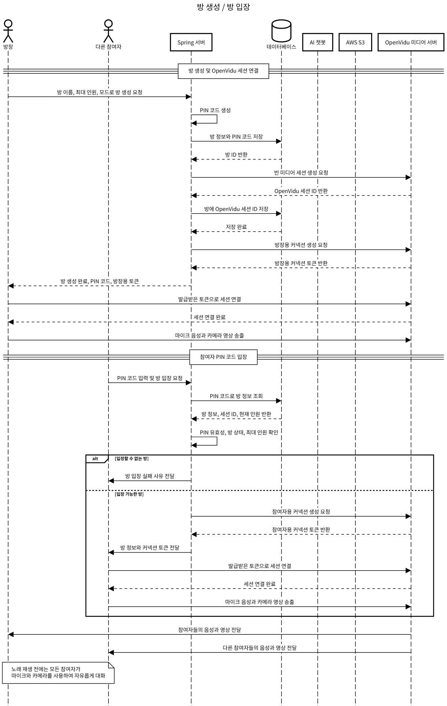
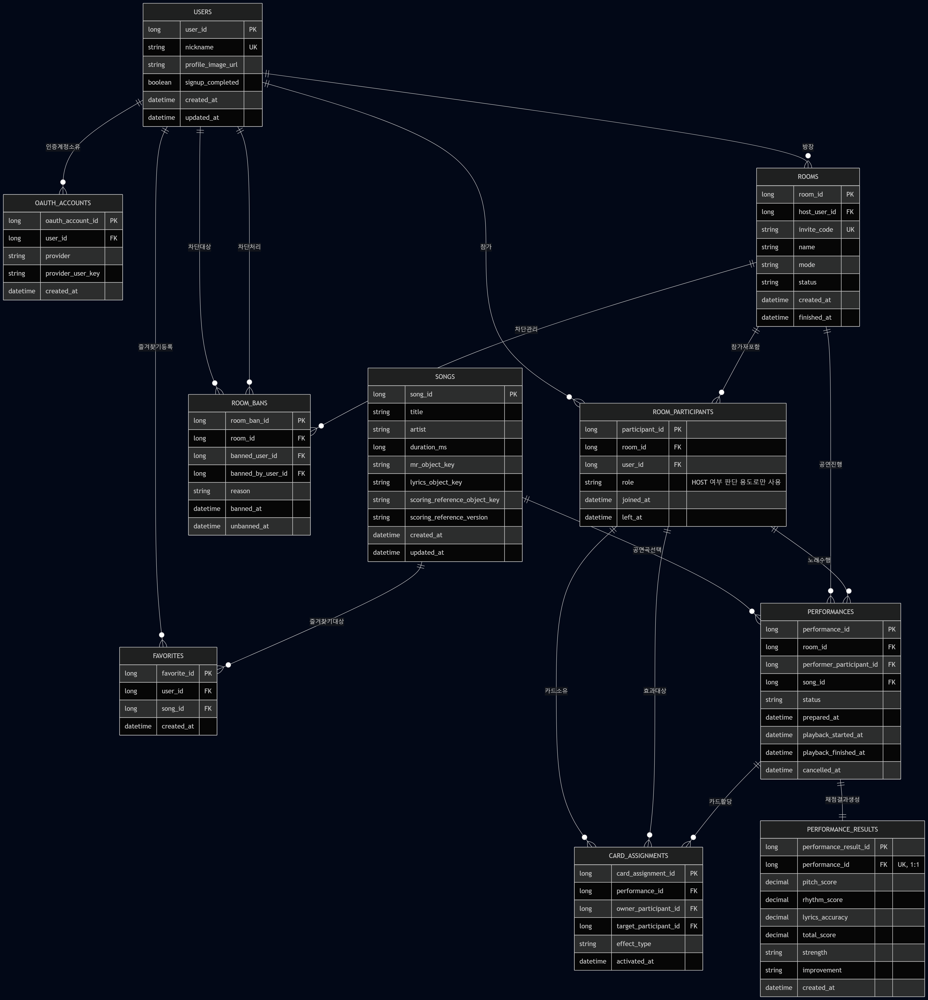

# 🎤 SSASUKAE (싸스케)

> ### "함께 부르고, 방해하고, AI에게 피드백 받는다"
>
> 친구들과 화상으로 만나 함께 부르고, 카드로 방해하고, AI에게 피드백 받는 실시간 화상 노래방 서비스

- **서비스명**: 싸스케 (SSASUKAE · SSAFY STAR K)
- **프로젝트 기간**: 2026.07.15 ~ 2026.08.13 (SSAFY 15기 공통 프로젝트)
- **개발 인원**: 6명 (FE · BE · AI · Native 교차 분담)
- **수상**: SSAFY 15기 공통 프로젝트 **우수상** 🏆
- **담당 파트 상세**: [📌 포트폴리오 문서 (트러블슈팅 · 코드 · 발표 자료)](PORTFOLIO_README.md)


> ⚠️ 프로젝트 기간 종료로 배포 서버(ssafystar-k.site)는 현재 운영이 중단된 상태입니다. 실제 동작은 [주요 화면 및 기능 소개](#주요-화면-및-기능-소개)의 GIF로 확인할 수 있습니다.

# 목차

- [기획 배경](#기획-배경)
- [주요 화면 및 기능 소개](#주요-화면-및-기능-소개)
- [프로젝트 핵심 기술](#프로젝트-핵심-기술)
- [시스템 아키텍처](#시스템-아키텍처)
- [ERD](#erd)
- [팀 & 담당 역할](#팀--담당-역할)
- [기술 스택](#기술-스택)
- [프로젝트 구조](#프로젝트-구조)
- [로컬 실행](#로컬-실행)
- [문서](#문서)

# 기획 배경

노래방은 여럿이 모여야 재밌는 놀이지만, 멀리 있는 친구와는 함께하기 어렵습니다. 화상 통화로 노래를 불러 봐도 잡음과 지연, 이펙트 없는 밋밋한 목소리 때문에 노래방 경험과는 거리가 멀었습니다.

싸스케는 설치 없이 브라우저만으로 노래방 마이크 같은 에코, 키·템포 조절, 실시간 가사 싱크와 채점을 제공하고, 여기에 화상 노래방에서만 가능한 놀이 — 상대를 방해하는 카드 배틀(수성전), 손 제스처 DSP 제어, AI 가창 피드백 — 를 더한 실시간 화상 노래방 서비스입니다.

브라우저 WebRTC의 지연 한계로 어려운 "동시에 함께 부르기"는 Rust 네이티브 클라이언트(초저지연 합창)로 따로 풀었습니다.

# 주요 화면 및 기능 소개

## 일반 공연방

<table>
  <tr>
    <th width="50%">공연 진행 · 실시간 가사 싱크</th>
    <th width="50%">곡 검색</th>
  </tr>
  <tr>
    <td valign="top">
      <br/><br/>
      <ul>
        <li>OpenVidu(WebRTC) 화상 + STOMP 실시간 이벤트로 여러 명이 한 방에서 순서대로 공연합니다.</li>
        <li>가사 하이라이트가 참가자별 지연을 실측·보정해 실제 들리는 소리와 맞게 표시됩니다.</li>
        <li>노래 중 에코·키·템포·볼륨을 조절할 수 있는 Web Audio 보컬 엔진이 동작합니다.</li>
        <li>pitchy 기반 실시간 피치 검출로 채점하고 S~F 등급을 산정합니다.</li>
      </ul>
    </td>
    <td valign="top">
      <br/><br/>
      <ul>
        <li>곡명·아티스트로 검색하고 인기 목록과 즐겨찾기(찜)를 관리할 수 있습니다.</li>
        <li>선택한 곡은 방의 공연 큐에 올라가 순서대로 진행됩니다.</li>
      </ul>
    </td>
  </tr>
</table>

## 수성전 (카드 배틀 모드)

<table>
  <tr>
    <th width="50%">카드 배틀 (히트 컷인 연출)</th>
    <th width="50%">제스처 인식 DSP 제어 · AR 필터</th>
  </tr>
  <tr>
    <td valign="top">
      <br/><br/>
      <ul>
        <li>노래 대결 중 상대에게 공격 카드를 날려 방해하는 배틀 모드입니다.</li>
        <li>원형 타이머, 히트 컷인, 음파 리플 등 카드 발동 연출을 CSS Keyframes로 구현했습니다.</li>
      </ul>
    </td>
    <td valign="top">
      <br/><br/>
      <ul>
        <li>카메라 손 제스처 인식(MediaPipe Hands)으로 노래 도중 음정·템포 DSP를 마우스 없이 제어합니다.</li>
        <li>가창자 화면에 AR 필터 연출이 함께 적용됩니다.</li>
      </ul>
    </td>
  </tr>
</table>

## AI 피드백 · 디바이스 설정

<table>
  <tr>
    <th width="50%">AI 가창 피드백 대시보드</th>
    <th width="50%">마이크·캠 디바이스 설정</th>
  </tr>
  <tr>
    <td valign="top">
      <br/><br/>
      <ul>
        <li>공연 녹음을 STT(Whisper)로 전사하고 RAG(pgvector) + LLM으로 맞춤 피드백을 생성합니다.</li>
        <li>마이페이지에서 공연 기록·점수·피드백 리스트와 상세를 조회할 수 있습니다.</li>
      </ul>
    </td>
    <td valign="top">
      <br/><br/>
      <ul>
        <li>공연 전 마이크·캠 장치를 선택하고 오디오 이펙트를 설정할 수 있습니다.</li>
        <li>RNNoise 기반 노이즈 억제가 마이크 스트림에 적용됩니다.</li>
      </ul>
    </td>
  </tr>
</table>

## 저지연 합창방 (Rust 네이티브 클라이언트)

- 브라우저 WebRTC의 지연 한계를 넘기 위한 별도 네이티브 오디오 클라이언트입니다.
- Opus Low Delay(2.5ms 프레임) + WASAPI + UDP Full Mesh P2P로 최대 4인 실시간 합창을 지원합니다.
- MR 동기 재생(리더 기준 ±0.5ms 드리프트 보정), Windows MSI 설치본을 제공합니다.

## 관리자 곡 등록 파이프라인

- 관리자가 원곡 mp3를 업로드하면 AI 서버가 보컬 분리 후 MR·기준 MIDI·난이도를 자동 생성합니다.
- 업로드 티켓(JWT) 방식으로 브라우저가 AI 서버에 직접 업로드하고, 분석 후 원곡은 폐기합니다.

# 프로젝트 핵심 기술

## Web Audio 보컬 엔진 — 송출·모니터·채점 3버스 분리

마이크 스트림 하나가 ① 청자 송출 ② 가창자 본인 모니터링 ③ 채점·STT 세 용도를 겸하면 왜곡이 생깁니다. WebRTC 루프백 모니터링은 지터 버퍼 지연 탓에 에코처럼 들리고, 이펙트 걸린 신호로 채점하면 점수가 흔들립니다.

- **모니터 버스**: WebRTC를 거치지 않고 로컬 오디오 그래프에서 직접 분기 → 지터 버퍼 지연 제거
- **채점·STT 탭**: 에코·음량 이펙트 이전의 드라이 신호에서 분기 → 이펙트가 점수에 섞이지 않음
- **송출 버스**: 컴프레서·리미터·메이크업 게인으로 청자가 듣는 음량만 별도 보정
- SoundTouch(WSOLA) 템포 스트레치 시 처리 지연만큼 모니터 목소리에 딜레이를 걸어 MR과 싱크 유지

## 실시간 가사 싱크 지연 보정

청자 화면의 가사 하이라이트가 실제 들리는 소리보다 앞서가는 문제를 실측 기반으로 보정했습니다.

- WebRTC `getStats()`의 `jitterBufferDelay` 누적치를 1초 주기로 폴링, 스냅샷 차분 + 지수이동평균(α=0.3)으로 **지터 버퍼 체류시간을 실측**
- 가사 시계의 기준 신호도 같은 네트워크 경로를 타므로 전송 지연은 상쇄 — 실측 지터 버퍼에 처리 비용(120ms)만 가산, 측정 전에는 220ms 폴백
- 소절(100ms)·음절(50ms) 틱을 분리하고 말단 컴포넌트만 리렌더해 렌더링 비용 억제

## AI 채점·피드백 파이프라인

- 판정(규칙 기반 로직) · 근거(RAG) · 표현(LLM)의 **역할 분리**로 "그럴듯하지만 근거 없는" 피드백을 방지
- 가창 오류를 서버에서 먼저 산출해 LLM에는 근거만 전달 — 프롬프트 토큰 **약 50~60% 절감**
- STT는 30초 청크 단위 전송, 무음 조각은 전송하지 않아 Whisper의 환각 전사를 차단

## Redis–MySQL 이중 쓰기 정합성

공연 상태(PREPARING → PLAYING → ANALYZING → FINISHED)가 Redis와 MySQL에 이중으로 기록되며 생기는 불일치·경쟁 상태를 해결했습니다.

- SAGA 패턴에서 영감을 얻은 **보상 로직**과 명시적 되돌림 Callback
- 분석 지연·유실에 대비한 **Timeout Worker**가 뒤늦은 덮어쓰기를 차단
- 락 없이 **Lua 스크립트 기반 CAS**로 이전 요청에 의한 상태 변경을 감지

## 초저지연 합창 (Rust)

- 합창이 가능한 현실적 기준은 평균 30ms — 미디어 서버 경유(120ms) 대신 **UDP 직접 연결로 22ms** 달성
- 발표 비유로: 소리 거리 41m(아파트 14층)에서 7.5m(2층)로

<details>
<summary><b>코어 플로우 시퀀스 다이어그램 (펼치기)</b></summary>

### 방 생성·입장


### 일반 노래방 모드


### 수성전 모드


</details>

# 시스템 아키텍처

> 💡 **노란 블록**이 직접 기획·개발을 담당한 영역입니다 (프론트엔드 전반 · AI 채점·피드백).


# ERD



# 팀 & 담당 역할

6인 팀 (BE · FE · AI · Native 교차 분담) 중 **FE · AI 파트**를 담당했습니다.

<table>
  <tr>
    <td align="center">
      
      
    </td>
  </tr>
  <tr>
    <td align="center">
      <br/>
      <a href="https://github.com/jangms11263124">장민석</a>
    </td>
  </tr>
</table>

- Web Audio 기반 **보컬 오디오 엔진** 구축 — 노이즈 억제·에코·템포/키 시프트, 송출·모니터·채점 3버스 분리 설계
- **공연 방 플로우** 전반 (대기 → 곡 선택 → 공연 → 채점) 및 실시간 가사 싱크·지연 보정
- **수성전 카드 배틀 연출** — 히트 컷인, 원형 타이머, 음파 리플
- 손 **제스처 인식 기반 DSP 실시간 제어**
- **AI 가창 피드백 파트 기획** 및 마이페이지(피드백 리스트·상세) 구현
- 디바이스 설정(마이크·캠), 곡 검색, 관리자 곡 업로드 화면
- **결선 발표 자료 제작** — [Morph 연출 GIF](docs/images/gifs/07_presentation_morph.gif) · [발췌 PDF](exec/싸스케_결선발표_발췌.pdf)

# 기술 스택

## Frontend

<div>
  
  
  
  
  
  
</div>

## Audio · Vision

<div>
  
  
  
  
  
  
</div>

## Backend

<div>
  
  
  
  
  
</div>

## AI

<div>
  
  
  
  
</div>

## Native · Infra

<div>
  
  
  
  
</div>

<details>
<summary><b>세부 스택 표 (펼치기)</b></summary>

| 영역 | 스택 |
|---|---|
| **프론트엔드** | Next.js 16, React 19, TypeScript 5, Tailwind CSS 4, zustand 5, TanStack Query 5, openvidu-browser, @stomp/stompjs |
| **오디오 처리** | Web Audio API, Tone.js, pitchy(피치 검출), SoundTouch AudioWorklet(템포·피치), RNNoise WASM(노이즈 억제) |
| **비전** | MediaPipe Hands(손 제스처 인식) |
| **백엔드** | Spring Boot 4.1 (Java 17), Spring Security + OAuth2(Google·Kakao), JPA, WebSocket(STOMP), Redis, openvidu-java-client, AWS S3 SDK |
| **AI** | FastAPI, OpenAI API(gpt-5-mini, whisper-1, text-embedding-3-small), PostgreSQL pgvector, audio-separator(GPU 보컬 분리), librosa, PyTorch |
| **네이티브** | Rust, Opus(Restricted Low Delay), WASAPI, UDP P2P(ICE+STUN), Windows MSI |
| **인프라** | Docker, OpenVidu Server, MySQL, Redis, AWS S3, GPU 런타임(RunPod) |

</details>

# 프로젝트 구조

```
├── frontend/   # Next.js 앱 (FSD: app / widgets / features / entities / shared)
├── backend/    # Spring Boot (domain 11개: room, performance, card, feedback, song, ...)
├── ai/
│   ├── scoring-feedback/   # 가창 채점·STT·RAG 피드백 (FastAPI)
│   └── song-analysis/      # 보컬 분리·MIDI 생성 (FastAPI, GPU)
├── native/
│   └── low-latency-audio/  # Rust 저지연 합창 클라이언트 + UDP relay 서버
└── docs/       # 컨벤션, 연동 스펙
```

# 로컬 실행

```bash
# 프론트엔드
cd frontend
pnpm install
pnpm dev        # http://localhost:3000

# 백엔드 (MySQL·Redis 필요)
cd backend/ssasukae
./gradlew bootRun

# AI 서버는 ai/README.md 참고 (song-analysis는 GPU 필요)
```

환경 변수 예시 파일: `frontend/.env.example`, `ai/scoring-feedback/.env.example`, `ai/song-analysis/.env.example`, `backend/ssasukae/src/main/resources/application-secret.example.yml`

# 문서

- [📌 담당 파트 상세 포트폴리오](PORTFOLIO_README.md)
- [전체 시연 영상 (MP4, 20MB)](docs/demo.mp4)
- [Git·코드 컨벤션](docs/convention/)
- [AI 곡 분석 연동 스펙](docs/integration/ai-song-analysis-spec.md)
- [저지연 오디오 클라이언트](native/low-latency-audio/README.md)
- [AI 서버](ai/README.md)
- [결선 발표 자료 발췌 (PDF, 14장)](exec/싸스케_결선발표_발췌.pdf) — Morph 연출 맛보기: [GIF](docs/images/gifs/07_presentation_morph.gif)
- [시연 시나리오 (PDF)](exec/싸스케_시연_시나리오.pdf)
- [포팅 매뉴얼 (PDF)](exec/싸스케_포팅_매뉴얼.pdf)
