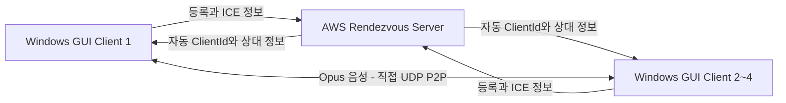
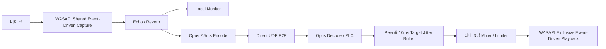

# ULTRA SYNC 실시간 합창 프로토타입

발표 및 공유용 기술 설명 문서  
마지막 갱신: 2026-07-23

## 1. 한 문장 소개

**ULTRA SYNC는 최대 4명의 Windows 사용자가 같은 방에 입장해, 서버를 거치지 않는 직접 P2P 경로로 저지연 음성을 주고받는 실시간 합창 프로토타입이다.**

일반적인 웹 서비스가 방과 사용자 상태를 관리한다면, 이 프로토타입은 실제 노래 목소리를 더 짧은 지연으로 전달하는 네이티브 고급 모드를 목표로 한다.

## 2. 해결하려는 문제

온라인 합창에서는 단순히 음성이 전달되는 것만으로 부족하다.

- 상대 목소리가 늦게 들리면 박자가 어긋난다.
- 지연 편차가 크면 음성이 끊기거나 기계음처럼 들린다.
- 여러 명의 음성을 서버가 중계하면 비용과 지연이 증가한다.
- 브라우저만으로는 오디오 장치와 버퍼를 세밀하게 제어하기 어렵다.

ULTRA SYNC는 Windows 네이티브 오디오와 직접 UDP P2P를 사용해 이 문제를 실험한다.

## 3. 사용자 경험

사용자가 직접 설정해야 하는 값은 두 가지뿐이다.

1. 닉네임 입력
2. 같은 방에서 사용할 세션 ID 입력

방에 입장하면 서버가 접속 순서대로 ClientId 1~4를 자동 할당한다. 이후 참가자 목록에서 상대방의 실제 닉네임과 연결 상태를 확인할 수 있다.

통화 중에는 다음 값을 실시간으로 조절할 수 있다.

- 내 목소리 모니터링 크기
- 원음 크기
- Echo 크기, delay, feedback
- Reverb 크기와 잔향 시간

최종 배포 파일은 `audio-gui.exe` 하나다. 별도의 script나 DLL을 함께 전달할 필요가 없고 CMD 창도 표시되지 않는다.

## 4. 화면 구성

GUI는 발표 레퍼런스의 3열 구성을 실시간 음성 기능에 맞게 적용했다.

| 왼쪽 | 중앙 | 오른쪽 |
| --- | --- | --- |
| 현재 참여자와 닉네임 | 내 닉네임, 세션, 연결 상태 | Local Monitor, Echo, Reverb |

메인 컬러는 보라색이며 연결 완료와 실시간 상태는 네온 계열 색상으로 구분한다.

## 5. 전체 구조



서버는 참가자를 연결해주는 역할만 한다. 실제 음성은 서버로 전송하지 않고 사용자 PC 사이에서 직접 교환한다.

### 제어 경로

AWS Rust rendezvous 서버가 담당한다.

- 세션별 참가자 등록
- 접속 순서대로 빈 ClientId 1~4 할당
- 상대방 닉네임 전달
- ICE candidate와 인증정보 전달
- 비활성 참가자 만료

### 음성 경로

Windows 클라이언트끼리 직접 처리한다.

- 마이크 입력
- Echo와 Reverb 처리
- Opus 인코딩
- 직접 UDP P2P 전송
- peer별 jitter buffer와 손실 보정
- 최대 3개의 상대 음성 믹싱
- 이어폰 출력

## 6. 오디오 처리 흐름



현재 주요 오디오 설정은 다음과 같다.

| 항목 | 현재값 |
| --- | ---: |
| 내부 sample rate | 48kHz |
| channel | Mono |
| codec | Opus Restricted Low Delay |
| frame 크기 | 120 samples / 2.5ms |
| bitrate | 128kbps constrained VBR |
| jitter buffer | peer별 목표 10ms, 최대 15ms |
| playback prebuffer | 0ms |
| 목표 playback queue | 3ms |
| 최대 참가자 | 4명 |
| 최대 직접 P2P 링크 | 6개 |

## 7. 왜 이렇게 설계했는가

### 서버가 음성을 중계하지 않는 이유

음성을 서버까지 보냈다가 다시 전달하면 네트워크 경로가 길어지고 서버 트래픽이 증가한다. Rendezvous 서버는 연결 정보만 교환하고, 음성은 가장 짧은 직접 경로를 사용한다.

### 2.5ms Opus를 사용하는 이유

PCM보다 전송량을 줄이면서도 일반적인 20ms 음성 frame보다 짧은 주기로 처리할 수 있다. 손실 시에는 Opus PLC가 직전 음성을 기반으로 짧은 빈 구간을 복원한다.

### peer별 buffer를 사용하는 이유

참가자마다 네트워크 상태가 다르다. 한 참가자의 지연이나 퇴장이 다른 참가자의 재생 상태를 초기화하지 않도록 peer별로 sequence, jitter buffer, decoder와 통계를 유지한다.

### 네이티브 Windows 앱을 사용하는 이유

입력은 WASAPI Shared Event-Driven과 `IAudioClient3` period 협상을 사용하고, 출력은 WASAPI Exclusive Event-Driven 최소 period를 사용한다. 제어 처리와 오디오 thread를 분리해 오디오 callback이 다른 작업 때문에 기다리지 않도록 한다.

## 8. 현재 구현된 기능

| 기능 | 상태 |
| --- | --- |
| Windows GUI와 audio-client 동반 배포 | 구현 완료 |
| 한글 UI와 보라색 네온 테마 | 구현 완료 |
| 닉네임과 세션 ID 입장 | 구현 완료 |
| 접속 순서 ClientId 자동 할당 | AWS 배포 및 검증 완료 |
| 상대방 실제 닉네임 표시 | AWS 전달 검증 완료 |
| 최대 4명 Full Mesh 구조 | 구현 완료 |
| 2.5ms Opus 직접 P2P 음성 | 구현 완료 |
| Local Monitor, Echo, Reverb | 구현 완료 |
| 참여자 입장·퇴장 반영 | 구현 완료 |
| 상세 결과 로그 자동 저장 | 구현 완료 |
| 로컬 WAV MR 재생 | 구현 완료 |
| 서버 2 기반 MR 다운로드와 동시 재생 | 미구현 |
| 인증·암호화·TURN relay | 미구현 |

## 9. 실제로 확인된 결과

### AWS 자동 입장 및 P2P 시험

두 클라이언트를 실제 AWS 서버에 연결한 결과다.

- 첫 번째 접속자: ClientId 1
- 두 번째 접속자: ClientId 2
- Alice 화면에서 Bob 닉네임 확인
- Bob 화면에서 Alice 닉네임 확인
- 양쪽 모두 직접 P2P 연결
- 합성 음성 시험에서 손상, 중복, 순서 뒤바뀜, PLC 0

```text
Client ID assigned: 1
Peer 2 nickname: Bob
Peer 2 audio path: direct P2P via ICE

Client ID assigned: 2
Peer 1 nickname: Alice
Peer 1 audio path: direct P2P via ICE
```

### 최대 4명 구조 시험

로컬 합성 4 client 시험에서는 전체 6개 P2P 링크가 형성됐고, 한 microphone frame을 최대 3명의 peer에게 보내는 fan-out과 수신 mixer 구조가 동작했다.

실제 Windows PC 4대에서 마이크와 이어폰을 사용한 장시간 시험은 아직 남아 있다.

### 실제 음성 로그에서 확인한 한계

한 실제 음성 실행에서는 P2P 연결과 장치 처리는 정상적이었지만 다음과 같은 네트워크 꼬리 지연이 확인됐다.

| 지표 | 측정값 |
| --- | ---: |
| RTT p50 | 9.8ms |
| RTT p95 | 28.2ms |
| RTT p99 | 59.4ms |
| 최대 RTT | 79.5ms |
| Opus PLC | 2,600 frames |
| Late frame | 2,468 frames |

평균 지연만 보면 빠르지만 순간적인 지연이 10ms jitter buffer를 넘어 음성 복원이 많이 발생했다. 이 결과는 낮은 평균 지연뿐 아니라 p95·p99와 PLC를 함께 봐야 한다는 점을 보여준다.

## 10. 측정과 확인 방법

GUI는 실행 파일 옆의 `results` 폴더에 상세 로그를 저장한다.

```text
audio-gui.exe
results/
└─ audio-client-<세션ID>-<닉네임>-<실행시각>.txt
```

로그에서 확인할 수 있는 항목:

- 실행 파일 SHA-256과 실행 환경
- 자동 할당 ClientId와 상대 닉네임
- ICE candidate와 직접 P2P 상태
- RTT min/mean/p50/p95/p99/max
- 손실, 중복, 순서 뒤바뀜
- PLC, late frame, playback resync
- underrun, trim, overflow
- capture/playback queue 추정값
- 이펙트 callback 처리시간
- 종료 코드

다른 사람이 결과를 확인할 때는 로컬 모니터 소리만으로 성공을 판단하지 않고 다음 문구를 확인한다.

```text
ICE state: Connected
Peer N audio path: direct P2P via ICE
```

## 11. 현재 개발 단계

| Phase | 내용 | 상태 |
| --- | --- | --- |
| Phase 0 | Rust workspace와 공통 module | 완료 |
| Phase 1 | AWS UDP 네트워크 측정 | 완료 |
| Phase 2 | Windows local audio와 monitoring | 완료 |
| Phase 3 | 최대 4명 Full Mesh P2P Opus | 구현 완료, 실제 PC 4대 검증 필요 |
| Phase 4 | 구간별 지연 계측 | 부분 완료 |
| Phase 4.5 | Windows GUI | 기본 기능 구현 완료, 실사용 회귀 필요 |
| Phase 5 | 로컬 WAV 재생 | 구현 완료 |
| Phase 5 | 서버 2 기반 MR 다운로드와 동기 재생 | 미구현 |
| Phase 6 | 기존 서비스 통합 | 미구현 |

현재 위치는 **발표용 mock-up이 아니라 실제 통신 시험이 가능한 고급 프로토타입**이다. 다만 사용자 인증과 보안, 다양한 NAT 대응, MR 동기화가 없어 상용 서비스 단계는 아니다.

## 12. 현재 한계

- TURN relay가 없어 대칭형 NAT 또는 UDP 차단 환경에서 연결이 실패할 수 있다.
- 세션 ID를 아는 사용자의 입장을 막을 인증이 없다.
- 음성 payload 암호화와 참가자 token이 없다.
- AWS UDP 50000 공개는 개발·시험 용도다.
- 실제 Windows PC 4대 음성 시험이 남아 있다.
- 외부 장비를 이용한 실제 mouth-to-ear 지연은 아직 측정하지 않았다.
- 로컬 모니터 전용 underrun 계측은 아직 없다.
- MR 다운로드, READY, 동시 재생과 drift correction은 아직 없다.

## 13. 다음 개발 순서

1. 실제 Windows PC 4대에서 10분 이상 음성 시험
2. 4개 로그를 모아 전체 6개 링크의 RTT tail, PLC, late frame 분석
3. 로컬 모니터 전용 underrun과 장치 clock drift 계측
4. 서버 1은 UDP P2P signaling으로 유지하고 서버 2 MR control 계약 설계
5. MR 사전 다운로드와 checksum 검증
6. 전체 참가자의 미래 공통 시각 동시 재생
7. 기존 노래방 서비스의 선택형 저지연 고급 모드로 통합

## 14. 발표 핵심 메시지

> ULTRA SYNC는 서버가 음성을 중계하지 않는 최대 4인 Windows 저지연 합창 엔진이다. 현재 자동 입장, 닉네임 교환, 직접 P2P 음성, 실시간 이펙트와 측정 GUI까지 구현했으며, AWS 2인 연결과 로컬 4인 Full Mesh 구조를 검증했다. 다음 과제는 실제 PC 4대 안정성, 네트워크 꼬리 지연 개선, 인증과 MR 동기 재생이다.

## 15. 확인 가능한 저장소 근거

- 현재 진행 상태: [`phase-status.md`](phase-status.md)
- 패킷 형식: [`packet-protocol.md`](packet-protocol.md)
- Spring 전환 방향: [`spring-realtime-server-direction.md`](spring-realtime-server-direction.md)
- GUI 코드: [`../apps/audio-gui/src/main.rs`](../apps/audio-gui/src/main.rs)
- 오디오·P2P 클라이언트: [`../apps/audio-client/src/main.rs`](../apps/audio-client/src/main.rs)
- AWS rendezvous 서버: [`../apps/audio-relay-server/src/main.rs`](../apps/audio-relay-server/src/main.rs)
